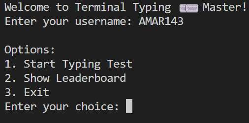
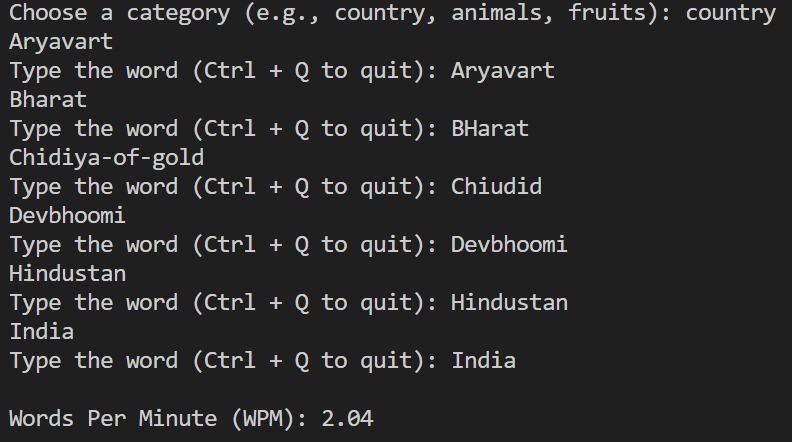
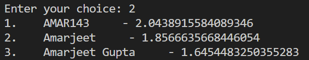

# Terminal Typing Master

## Overview

Terminal Typing Master is a command-line tool designed to enhance your typing skills right from the comfort of your terminal. Whether you're a beginner looking to improve your typing speed or an advanced user aiming for perfection, this tool provides a challenging and customizable environment for honing your typing abilities.

## Features

- **Customizable Practice Sessions:** Tailor your typing practice to focus on specific areas such as speed, accuracy, or the use of special characters.

- **Varied Text Sources:** Practice typing with a diverse range of texts, including programming code snippets, famous quotes, or custom texts of your choice.

- **Real-time Statistics:** Receive immediate feedback on your typing performance, including words per minute (WPM), accuracy percentage, and error count.

- **Progress Tracking:** Monitor your progress over time with detailed session logs and historical data.

- **Interactive User Interface:** A user-friendly command-line interface makes it easy to navigate and configure your typing practice sessions.

## Installation

To install Terminal Typing Master, follow these steps:

1. Clone the repository to your local machine:

    
   ```
      git clone https://github.com/Amarjeet5822/Typing-Master-Test-Terminal-Base.git
   ```
2. Navigate to the cloned directory:

    
   ```
   cd Typing-Master-Test-Terminal-Base
   ```
    

3. Install the necessary dependencies:

    
   ```
      pip install time
   ```

   ```  
      pip install termcolor
   ``` 

   ``` 
      pip install json
   ``` 

## Usage

Once installed, you can launch Terminal Typing Master by running the following command:


```
   python Terminal_master.py
```


Follow the on-screen instructions to initiate typing practice sessions and improve your typing skills.

## Starting


## Results


## Leaderboard


## Contributing

We welcome contributions to Terminal Typing Master! If you would like to contribute, please follow these guidelines:

1. Fork the repository on GitHub.
2. Create a new branch from the main branch.
3. Make your desired changes.
4. Test your changes thoroughly.
5. Create a pull request with a clear description of your changes.


## Acknowledgments

We would like to express our gratitude to all contributors who have helped improve Terminal Typing Master.

## Contact

For any inquiries or support, please contact us at [amar.bst5822@gmail.com](mailto:amar.bst5822@gmail.com)
